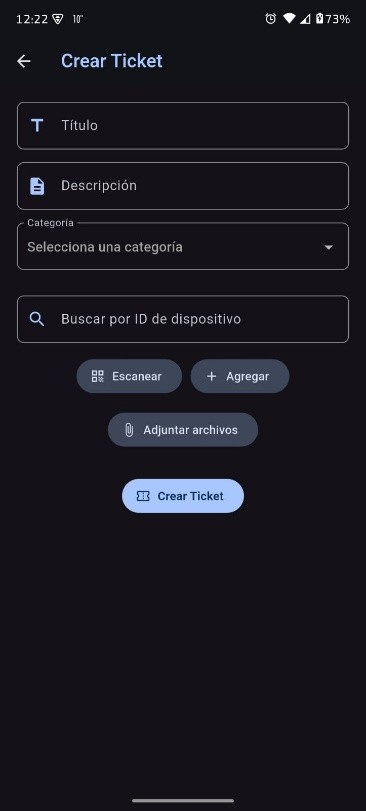
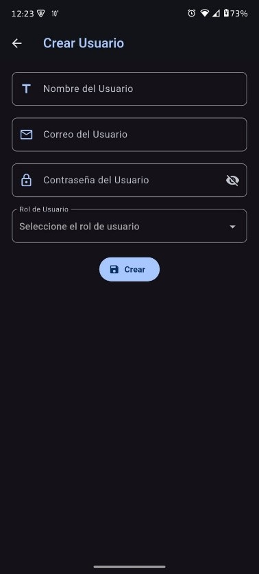
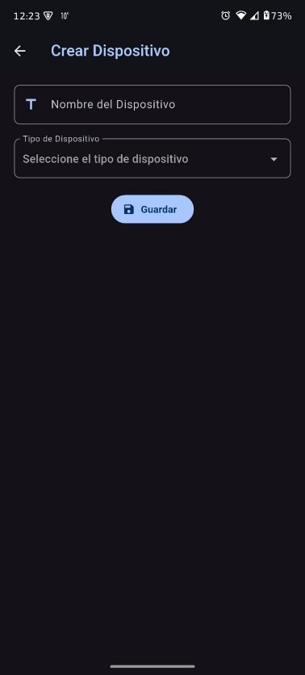
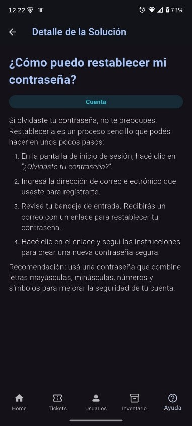
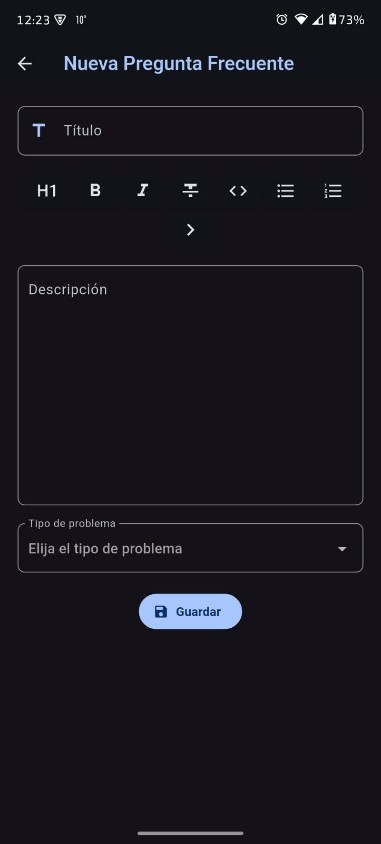

  

# Elanel Asistencia IT - Gestión de Soporte Técnico / Technical Support Management

   
   
   

## 📝 Descripción / Description
Esta aplicación fue diseñada para optimizar la gestión de incidentes técnicos en **Elanel IT**. Permite a los técnicos y administradores centralizar el flujo de trabajo de reparaciones, mantenimiento preventivo y control de inventario de dispositivos.

This application was designed to optimize technical incident management at **Elanel IT**. It allows technicians and administrators to centralize the workflow for repairs, preventive maintenance, and device inventory control.

### Características Principales / Key Features:
- 🎫 **Gestión de Tickets / Ticket Management:** Creación, asignación y seguimiento de estados en tiempo real. / Creation, assignment, and real-time status tracking.
- 🔍 **Escaneo QR / QR Scanning:** Identificación rápida de dispositivos mediante códigos QR. / Quick device identification using QR codes.
- 📊 **Inventario / Inventory:** Control detallado de hardware y software por usuario. / Detailed hardware and software control per user.
- 🌓 **Modo Oscuro/Claro / Dark/Light Mode:** Interfaz adaptativa mediante Riverpod. / Adaptive interface powered by Riverpod.

### 📸 Galería del Proyecto / Project Gallery

  <table>
    <tr>
      <td align="center"><b>Vista Principal / Main View</b></td>
      <td align="center"><b>Gestión de Tickets / Ticket Management</b></td>
      <td align="center"><b>Detalle de Ticket / Ticket Details</b></td>
    </tr>
    <tr>
      <td></td>
      <td></td>
      <td></td>
    </tr>
  </table>

  
<b>👉 Ver capturas adicionales por categoría (Click para desplegar) / See more screenshots by category (Click to expand)</b>

   

  #### 🎫 Gestión de Tickets y Usuarios / Ticket and User Management
  | Nuevo Ticket / New Ticket | Usuarios / Users | Perfil / Profile | Registro / Registration |
  | :---: | :---: | :---: | :---: |
  |  |  |  |  |

  #### 📦 Inventario y Dispositivos / Inventory and Devices
  | Inventario / Inventory | Detalle / Details | Alta / New Asset |
  | :---: | :---: | :---: |
  |  |  |  |

  #### 💡 Centro de Ayuda (FAQ) / Help Center
  | Preguntas / FAQ | Solución / Solution | Nueva Pregunta / New Question |
  | :---: | :---: | :---: |
  |  |  |  |

## 🏗️ Arquitectura y Stack Técnico / Architecture and Technical Stack

El proyecto sigue los principios de **Clean Architecture**, separando las responsabilidades en capas bien definidas para facilitar el mantenimiento y la escalabilidad:

The project follows **Clean Architecture** principles, separating responsibilities into well-defined layers to facilitate maintenance and scalability:

- **Domain:** Entidades de negocio y contratos (Repositories). / Business entities and contracts (Repositories).
- **Infrastructure:** Implementación de repositorios, Data Sources y Mappers para Firebase. / Repository implementation, Data Sources, and Mappers for Firebase.
- **Presentation:** UI con widgets optimizados y gestión de estado reactiva. / UI with optimized widgets and reactive state management.

### Tecnologías utilizadas / Technologies used:
- **Estado / State:** [Riverpod](https://riverpod.dev/) (StateNotifier & Providers).
- **Navegación / Navigation:** [GoRouter](https://pub.dev/packages/go_router).
- **Backend:** Firebase (Firestore & Auth).
- **Estilo / Style:** Material 3.

## ✉️ Contacto / Contact
Luca Valentino Rossi - [valerossi2004@gmail.com](mailto:valerossi2004@gmail.com) - [LinkedIn](https://www.linkedin.com/in/lucavalentinorossi/)
